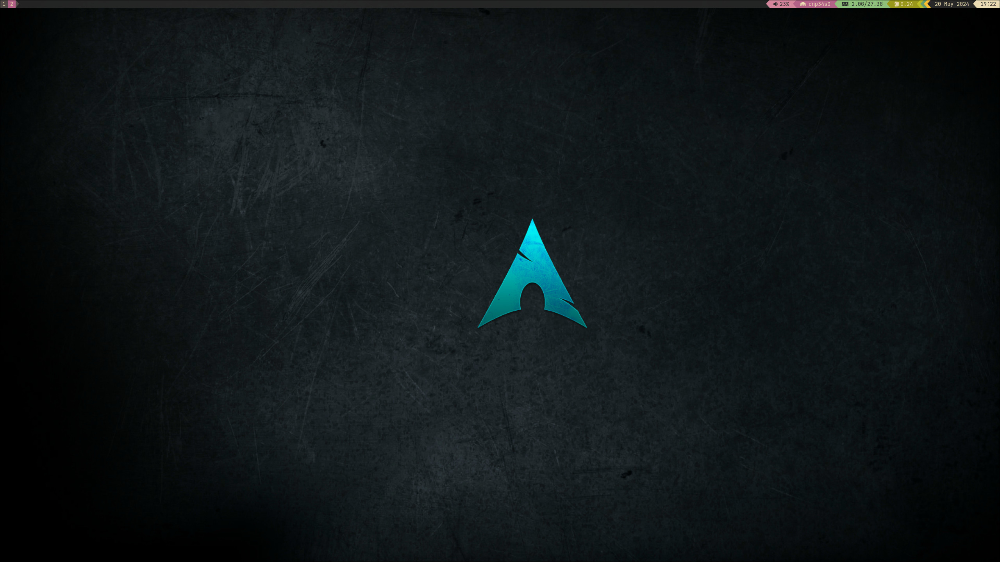

# My Arch Linux Ansible Playbook



Here is a summary of the tasks performed by the Ansible playbook:

Docker, libvirt with KVM, Rust and Cargo, Golang, C++ Build-Tools, net-tools, minikube and kubectl(Local Kubernetes cluster)

Hyprland(Wayland) Destkop Environment (optional):
hyprland nwg-displays nwg-look-bin wpaperd wezterm wl-clipboard cliphist wofi grim gdm
nemo(File Manager), firefox(Browser), waybar(Status bar), flat-remix and flat-remix-gtk (Theme)
Flatpak, full nerd-fonts group, Asian Characters support

```
 ansible-playbook -i localhost, -c local playbook.yml
```

local or ssh-password with ssh-key

```
ansible-playbook -i <IP-Adresse>, -u <Username> -k -K my-arch-linux-playbook.yml --private-key ~/.ssh/mykey my-arch-linux-playbook.yml
```

When installing yay, there are problems with sudo, so I introduced it for Ansible and then removed it again

```
[root@archlinux username]# visudo
username ALL=(ALL) NOPASSWD: ALL
```

Source form pic by malkowitch: 

https://www.deviantart.com/malkowitch/art/Minimalistic-Arch-Linux-Wallpaper-634403008

